# stonks_db — Esquema de Relaciones

> 40 tablas · 11 esquemas · 45 foreign keys · ~9.7M filas totales
> Generado: 2026-04-23

## Resumen por esquema

| Esquema | Tablas | Filas totales | Tamaño | Descripción |
|---------|--------|--------------|--------|-------------|
| **ref** | 4 | 425 | ~224 KB | Datos de referencia (países, monedas, bolsas, sectores) |
| **meta** | 3 | 8.287 | ~1.6 MB | Auditoría, fuentes de datos, calidad |
| **macro** | 4 | 108.357 | ~17 MB | Indicadores macroeconómicos y series temporales |
| **equity** | 9 | 8.886.037 | ~1.575 GB | Acciones, precios, fundamentales, dividendos |
| **fi** | 4 | 83.703 | ~12 MB | Renta fija: bonos, ratings, curvas de yield |
| **commodity** | 2 | 104.881 | ~15 MB | Materias primas y precios |
| **forex** | 2 | 183.176 | ~27 MB | Pares de divisas y tipos de cambio |
| **crypto** | 3 | 10.990 | ~1.7 MB | Criptomonedas y dominancia |
| **fund** | 2 | 132.303 | ~15 MB | ETFs/fondos y NAV |
| **country** | 3 | 1.038 | ~656 KB | Perfiles de país, demografía, impuestos |
| **alt** | 4 | 5.635 | ~760 KB | Datos alternativos: sentimiento, vivienda |

---

## Diagrama de relaciones (Mermaid)

```mermaid
erDiagram

    %% ═══════════════════════════════════════
    %% ESQUEMA: ref (Datos de referencia)
    %% ═══════════════════════════════════════

    ref_country {
        varchar code PK "ISO 3166-1 alpha-2"
        varchar name
        varchar region
        varchar subregion
        varchar capital
        numeric latitude
        numeric longitude
    }

    ref_currency {
        varchar code PK "ISO 4217"
        varchar name
        int decimal_places
    }

    ref_exchange {
        int id PK
        varchar mic "Market Identifier Code"
        varchar name
        varchar country_code FK
        varchar currency_code FK
        varchar timezone
        time open_time
        time close_time
    }

    ref_sector {
        int id PK
        varchar code
        varchar name
        varchar level "sector/industry_group/industry/sub_industry"
        int parent_id FK
    }

    ref_country ||--o{ ref_exchange : "country_code"
    ref_currency ||--o{ ref_exchange : "currency_code"
    ref_sector ||--o{ ref_sector : "parent_id (jerarquia GICS)"

    %% ═══════════════════════════════════════
    %% ESQUEMA: meta (Auditoría)
    %% ═══════════════════════════════════════

    meta_data_source {
        int id PK
        varchar name
        varchar base_url
        numeric rate_limit_rps
        varchar api_key_env
        boolean enabled
    }

    meta_fetch_run {
        int id PK
        int source_id FK
        varchar domain
        timestamp started_at
        timestamp finished_at
        varchar status
        int records_fetched
        int records_inserted
        int errors
        jsonb params
        jsonb error_log
    }

    meta_data_quality {
        int id PK
        varchar schema_name
        varchar table_name
        numeric completeness
        timestamp last_check
    }

    meta_data_source ||--o{ meta_fetch_run : "source_id (logica)"

    %% ═══════════════════════════════════════
    %% ESQUEMA: macro (Macroeconómico)
    %% ═══════════════════════════════════════

    macro_indicator {
        int id PK
        varchar code
        varchar name
        varchar category
        varchar unit
        varchar frequency
    }

    macro_indicator_source {
        int id PK
        int indicator_id FK
        int source_id FK
        varchar source_code
    }

    macro_series {
        int id PK
        int indicator_id FK
        varchar country_code FK
        varchar region
        date last_date
        numeric last_value
        int point_count
    }

    macro_data_point {
        int id PK
        int series_id FK
        int source_id FK
        date date
        numeric value
    }

    macro_indicator ||--o{ macro_indicator_source : "indicator_id"
    macro_indicator ||--o{ macro_series : "indicator_id"
    macro_series ||--o{ macro_data_point : "series_id"
    meta_data_source ||--o{ macro_data_point : "source_id"
    meta_data_source ||--o{ macro_indicator_source : "source_id"

    %% ═══════════════════════════════════════
    %% ESQUEMA: equity (Renta variable)
    %% ═══════════════════════════════════════

    equity_company {
        int id PK
        varchar ticker
        varchar isin
        varchar name
        varchar country_code FK
        varchar currency_code FK
        int exchange_id FK
        int sector_id FK
        numeric market_cap_usd
        bigint shares_outstanding
        date ipo_date
        date delisted_date
        boolean is_active
        varchar website
        text description
        int employees
        timestamp last_updated
    }

    equity_price_daily {
        int id PK
        int company_id FK
        int source_id FK
        date date
        numeric open
        numeric high
        numeric low
        numeric close
        numeric adj_close
        bigint volume
    }

    equity_income_statement {
        int id PK
        int company_id FK
        int source_id FK
        date period_end
        varchar period_type
        numeric revenue
        numeric gross_profit
        numeric operating_income
        numeric net_income
        numeric eps
        numeric ebitda
    }

    equity_balance_sheet {
        int id PK
        int company_id FK
        int source_id FK
        date period_end
        varchar period_type
        numeric total_assets
        numeric total_liabilities
        numeric total_equity
        numeric cash
        numeric total_debt
    }

    equity_cash_flow {
        int id PK
        int company_id FK
        int source_id FK
        date period_end
        varchar period_type
        numeric operating_cf
        numeric investing_cf
        numeric financing_cf
        numeric free_cf
        numeric capex
    }

    equity_dividend {
        int id PK
        int company_id FK
        date ex_date
        date pay_date
        numeric amount
    }

    equity_split {
        int id PK
        int company_id FK
        date date
        numeric ratio_from
        numeric ratio_to
    }

    equity_market_index {
        int id PK
        varchar symbol
        varchar name
        varchar country_code FK
        int exchange_id FK
    }

    equity_index_price {
        int id PK
        int index_id FK
        date date
        numeric open
        numeric high
        numeric low
        numeric close
        bigint volume
    }

    equity_company ||--o{ equity_price_daily : "company_id"
    equity_company ||--o{ equity_income_statement : "company_id"
    equity_company ||--o{ equity_balance_sheet : "company_id"
    equity_company ||--o{ equity_cash_flow : "company_id"
    equity_company ||--o{ equity_dividend : "company_id"
    equity_company ||--o{ equity_split : "company_id"
    equity_market_index ||--o{ equity_index_price : "index_id"
    meta_data_source ||--o{ equity_price_daily : "source_id"
    meta_data_source ||--o{ equity_income_statement : "source_id"
    meta_data_source ||--o{ equity_balance_sheet : "source_id"
    meta_data_source ||--o{ equity_cash_flow : "source_id"

    %% ═══════════════════════════════════════
    %% ESQUEMA: fi (Renta fija)
    %% ═══════════════════════════════════════

    fi_bond_issuer {
        int id PK
        varchar name
        varchar issuer_type "government/corporate"
        varchar country_code FK
    }

    fi_bond {
        int id PK
        int issuer_id FK
        varchar isin "CUSIP para US Treasury"
        varchar name
        numeric coupon_rate
        smallint coupon_frequency
        date maturity_date
        date issue_date
        numeric face_value
        varchar currency_code
        varchar bond_type
        boolean is_callable
    }

    fi_credit_rating {
        int id PK
        int issuer_id FK
        varchar agency "SP/Moodys/Fitch"
        varchar rating
        varchar outlook
        date rating_date
        varchar previous_rating
    }

    fi_yield_curve {
        int id PK
        int source_id FK
        varchar country_code FK
        date date
        smallint maturity_months
        numeric yield_pct
    }

    fi_bond_issuer ||--o{ fi_bond : "issuer_id"
    fi_bond_issuer ||--o{ fi_credit_rating : "issuer_id"
    meta_data_source ||--o{ fi_yield_curve : "source_id"

    %% ═══════════════════════════════════════
    %% ESQUEMA: commodity (Materias primas)
    %% ═══════════════════════════════════════

    commodity_commodity {
        int id PK
        varchar code
        varchar name
        varchar category "energy/metals/agriculture"
        varchar unit
    }

    commodity_price_daily {
        int id PK
        int commodity_id FK
        int source_id FK
        date date
        numeric open
        numeric high
        numeric low
        numeric close
        bigint volume
    }

    commodity_commodity ||--o{ commodity_price_daily : "commodity_id"
    meta_data_source ||--o{ commodity_price_daily : "source_id"

    %% ═══════════════════════════════════════
    %% ESQUEMA: forex (Divisas)
    %% ═══════════════════════════════════════

    forex_currency_pair {
        int id PK
        varchar base_currency FK
        varchar quote_currency FK
        varchar pair_code
        varchar category "major/minor/exotic"
    }

    forex_rate_daily {
        int id PK
        int pair_id FK
        int source_id FK
        date date
        numeric open
        numeric high
        numeric low
        numeric close
    }

    forex_currency_pair ||--o{ forex_rate_daily : "pair_id"
    meta_data_source ||--o{ forex_rate_daily : "source_id"

    %% ═══════════════════════════════════════
    %% ESQUEMA: crypto (Criptomonedas)
    %% ═══════════════════════════════════════

    crypto_coin {
        int id PK
        varchar coingecko_id
        varchar symbol
        varchar name
    }

    crypto_price_daily {
        int id PK
        int coin_id FK "sin FK formal"
        date date
        numeric price_usd
        numeric volume_usd
        numeric market_cap
    }

    crypto_market_dominance {
        int id PK
        date date
        numeric btc_pct
        numeric eth_pct
    }

    %% ═══════════════════════════════════════
    %% ESQUEMA: fund (Fondos/ETFs)
    %% ═══════════════════════════════════════

    fund_fund {
        int id PK
        varchar ticker
        varchar name
        varchar fund_type "ETF/mutual_fund"
        int exchange_id FK
        numeric aum
        numeric expense_ratio
        varchar currency
    }

    fund_nav_daily {
        int id PK
        int fund_id FK
        date date
        numeric nav
        numeric total_return
    }

    fund_fund ||--o{ fund_nav_daily : "fund_id"

    %% ═══════════════════════════════════════
    %% ESQUEMA: country (Perfiles de país)
    %% ═══════════════════════════════════════

    country_profile {
        int id PK
        varchar country_code FK
        numeric gdp_usd
        numeric gdp_per_capita
        numeric hdi
        numeric gini
        int ease_of_business_rank
    }

    country_demographics {
        int id PK
        varchar country_code FK
        int year
        bigint population
        numeric median_age
        numeric urbanization_pct
        numeric fertility_rate
    }

    country_tax_rate {
        int id PK
        varchar country_code FK
        int year
        numeric corporate_tax
        numeric income_tax_max
        numeric vat
        numeric capital_gains_tax
    }

    %% ═══════════════════════════════════════
    %% ESQUEMA: alt (Datos alternativos)
    %% ═══════════════════════════════════════

    alt_sentiment_indicator {
        int id PK
        varchar code
        varchar name
        text description
    }

    alt_sentiment_value {
        int id PK
        int indicator_id FK
        date date
        numeric value
    }

    alt_housing_index {
        int id PK
        varchar code
        varchar name
        varchar country_code FK
        varchar index_type
    }

    alt_housing_index_value {
        int id PK
        int index_id FK
        date date
        numeric value
        numeric yoy_change_pct
    }

    alt_sentiment_indicator ||--o{ alt_sentiment_value : "indicator_id"
    alt_housing_index ||--o{ alt_housing_index_value : "index_id"

    %% ═══════════════════════════════════════
    %% RELACIONES CROSS-SCHEMA (FKs formales)
    %% ═══════════════════════════════════════

    ref_country ||--o{ macro_series : "country_code"
    ref_country ||--o{ equity_company : "country_code"
    ref_country ||--o{ equity_market_index : "country_code"
    ref_country ||--o{ fi_bond_issuer : "country_code"
    ref_country ||--o{ fi_yield_curve : "country_code"
    ref_country ||--o{ country_profile : "country_code"
    ref_country ||--o{ country_demographics : "country_code"
    ref_country ||--o{ country_tax_rate : "country_code"
    ref_country ||--o{ alt_housing_index : "country_code"
    ref_currency ||--o{ equity_company : "currency_code"
    ref_currency ||--o{ forex_currency_pair : "base_currency"
    ref_currency ||--o{ forex_currency_pair : "quote_currency"
    ref_exchange ||--o{ equity_company : "exchange_id"
    ref_exchange ||--o{ equity_market_index : "exchange_id"
    ref_exchange ||--o{ fund_fund : "exchange_id"
    ref_sector ||--o{ equity_company : "sector_id"
```



---

## Relaciones formales (Foreign Keys) — 45 totales

### Dentro de `ref` (3)
| # | Tabla origen | Columna FK | → Tabla destino | Columna |
|---|-------------|-----------|----------------|---------|
| 1 | `ref.exchange` | `country_code` | → `ref.country` | `code` |
| 2 | `ref.exchange` | `currency_code` | → `ref.currency` | `code` |
| 3 | `ref.sector` | `parent_id` | → `ref.sector` | `id` |

### Schema `macro` (5)
| # | Tabla origen | Columna FK | → Tabla destino | Columna |
|---|-------------|-----------|----------------|---------|
| 4 | `macro.indicator_source` | `indicator_id` | → `macro.indicator` | `id` |
| 5 | `macro.indicator_source` | `source_id` | → `meta.data_source` | `id` |
| 6 | `macro.series` | `indicator_id` | → `macro.indicator` | `id` |
| 7 | `macro.series` | `country_code` | → `ref.country` | `code` |
| 8 | `macro.data_point` | `series_id` | → `macro.series` | `id` |
| 9 | `macro.data_point` | `source_id` | → `meta.data_source` | `id` |

### Schema `equity` (12)
| # | Tabla origen | Columna FK | → Tabla destino | Columna |
|---|-------------|-----------|----------------|---------|
| 10 | `equity.company` | `country_code` | → `ref.country` | `code` |
| 11 | `equity.company` | `currency_code` | → `ref.currency` | `code` |
| 12 | `equity.company` | `exchange_id` | → `ref.exchange` | `id` |
| 13 | `equity.company` | `sector_id` | → `ref.sector` | `id` |
| 14 | `equity.price_daily` | `company_id` | → `equity.company` | `id` |
| 15 | `equity.price_daily` | `source_id` | → `meta.data_source` | `id` |
| 16 | `equity.income_statement` | `company_id` | → `equity.company` | `id` |
| 17 | `equity.income_statement` | `source_id` | → `meta.data_source` | `id` |
| 18 | `equity.balance_sheet` | `company_id` | → `equity.company` | `id` |
| 19 | `equity.balance_sheet` | `source_id` | → `meta.data_source` | `id` |
| 20 | `equity.cash_flow` | `company_id` | → `equity.company` | `id` |
| 21 | `equity.cash_flow` | `source_id` | → `meta.data_source` | `id` |
| 22 | `equity.dividend` | `company_id` | → `equity.company` | `id` |
| 23 | `equity.split` | `company_id` | → `equity.company` | `id` |
| 24 | `equity.market_index` | `country_code` | → `ref.country` | `code` |
| 25 | `equity.market_index` | `exchange_id` | → `ref.exchange` | `id` |
| 26 | `equity.index_price` | `index_id` | → `equity.market_index` | `id` |

### Schema `fi` (5)
| # | Tabla origen | Columna FK | → Tabla destino | Columna |
|---|-------------|-----------|----------------|---------|
| 27 | `fi.bond_issuer` | `country_code` | → `ref.country` | `code` |
| 28 | `fi.bond` | `issuer_id` | → `fi.bond_issuer` | `id` |
| 29 | `fi.credit_rating` | `issuer_id` | → `fi.bond_issuer` | `id` |
| 30 | `fi.yield_curve` | `country_code` | → `ref.country` | `code` |
| 31 | `fi.yield_curve` | `source_id` | → `meta.data_source` | `id` |

### Otros schemas (14)
| # | Tabla origen | Columna FK | → Tabla destino | Columna |
|---|-------------|-----------|----------------|---------|
| 32 | `commodity.price_daily` | `commodity_id` | → `commodity.commodity` | `id` |
| 33 | `commodity.price_daily` | `source_id` | → `meta.data_source` | `id` |
| 34 | `forex.currency_pair` | `base_currency` | → `ref.currency` | `code` |
| 35 | `forex.currency_pair` | `quote_currency` | → `ref.currency` | `code` |
| 36 | `forex.rate_daily` | `pair_id` | → `forex.currency_pair` | `id` |
| 37 | `forex.rate_daily` | `source_id` | → `meta.data_source` | `id` |
| 38 | `fund.fund` | `exchange_id` | → `ref.exchange` | `id` |
| 39 | `fund.nav_daily` | `fund_id` | → `fund.fund` | `id` |
| 40 | `country.profile` | `country_code` | → `ref.country` | `code` |
| 41 | `country.demographics` | `country_code` | → `ref.country` | `code` |
| 42 | `country.tax_rate` | `country_code` | → `ref.country` | `code` |
| 43 | `alt.housing_index` | `country_code` | → `ref.country` | `code` |
| 44 | `alt.sentiment_value` | `indicator_id` | → `alt.sentiment_indicator` | `id` |
| 45 | `alt.housing_index_value` | `index_id` | → `alt.housing_index` | `id` |

> **Nota:** Las FKs a `meta.data_source.id` en tablas de datos permiten auditar
> de qué fuente vino cada registro (FRED, yfinance, ECB, Treasury, etc.)

---

## Tablas más grandes (datos reales)

| Tabla | Filas | Tamaño | Rango fechas |
|-------|------:|--------|--------------|
| `equity.price_daily` | 8.521.733 | 1,5 GB | 1962-01-02 → 2026-04-23 |
| `equity.index_price` | 189.345 | 27 MB | 1927-12-30 → 2026-04-23 |
| `forex.rate_daily` | 183.177 | 27 MB | 1999-01-04 → 2026-04-22 |
| `equity.dividend` | 134.600 | 15 MB | 1962-01-16 → 2026-04-23 |
| `fund.nav_daily` | 132.304 | 14 MB | 1993-01-29 → 2026-04-22 |
| `macro.data_point` | 107.565 | 15 MB | 1960-01-01 → 2026-04-22 |
| `commodity.price_daily` | 104.882 | 15 MB | 1997-10-29 → 2026-04-22 |
| `fi.yield_curve` | 68.072 | 9,6 MB | 1962-01-02 → 2026-04-21 |
| `equity.cash_flow` | 11.214 | 2,2 MB | 2021-04-30 → 2026-03-31 |
| `equity.balance_sheet` | 11.119 | 2,6 MB | 2021-04-30 → 2026-03-31 |

---

## Cobertura histórica por schema

| Schema | Desde | Comentario |
|--------|-------|------------|
| `equity.index_price` | **1927** | Dow Jones, S&P 500 histórico completo |
| `macro.data_point` | **1960** | FRED desde Bretton Woods era |
| `fi.yield_curve` | **1962** | US Treasury yields completo |
| `equity.price_daily` | **1962** | Blue chips con histórico largo |
| `equity.dividend` | **1962** | Histórico completo de dividendos |
| `fi.bond` | **1980** | US Treasury auctions (Fiscal Data API) |
| `fund.nav_daily` | **1993** | Desde el primer ETF (SPY) |
| `commodity.price_daily` | **1997** | yfinance commodities |
| `forex.rate_daily` | **1999** | ECB (desde creación del EUR) |
| `alt.sentiment_value` | **1960** | VIX, Consumer Sentiment |
| `fi.credit_rating` | **2012** | Fitch Sovereign (ratingshistory.info) |
| `crypto.price_daily` | **2025** | CoinGecko (rate limit limita histórico) |
| Fundamentales equity | **2021** | Income/Balance/Cash flow |

---

## Tablas vacías o parcialmente pobladas

- `crypto.market_dominance` — Dominancia BTC/ETH (0 filas)
- `country.tax_rate` — Tasas impositivas (0 filas)
- `alt.housing_index`, `alt.housing_index_value` — Índices de vivienda (0 filas)
- `meta.data_quality` — Scores de calidad de datos (0 filas)
- `crypto.price_daily` — Solo ~1 año de histórico (rate limit CoinGecko)

---

## Queries de ejemplo para análisis

### Precio de acción + fundamentales de una empresa
```sql
SELECT c.ticker, c.name, p.date, p.close, p.volume,
       i.revenue, i.net_income, i.eps
FROM equity.company c
JOIN equity.price_daily p ON p.company_id = c.id
LEFT JOIN equity.income_statement i ON i.company_id = c.id
WHERE c.ticker = 'AAPL'
ORDER BY p.date DESC LIMIT 10;
```

### PIB per capita + indicadores macro por país
```sql
SELECT rc.name AS pais, mi.name AS indicador,
       dp.date, dp.value
FROM macro.data_point dp
JOIN macro.series s ON s.id = dp.series_id
JOIN macro.indicator mi ON mi.id = s.indicator_id
JOIN ref.country rc ON rc.code = s.country_code
WHERE rc.code = 'ES' AND mi.category = 'gdp'
ORDER BY dp.date DESC;
```

### Correlación: oro vs S&P500
```sql
SELECT g.date, g.close AS gold, sp.close AS sp500
FROM commodity.price_daily g
JOIN commodity.commodity gc ON gc.id = g.commodity_id
CROSS JOIN (
    SELECT ip.date, ip.close
    FROM equity.index_price ip
    JOIN equity.market_index mi ON mi.id = ip.index_id
    WHERE mi.symbol = 'SPX'
) sp ON sp.date = g.date
WHERE gc.code = 'GC'
ORDER BY g.date;
```

### Vista cross-schema: país completo
```sql
SELECT rc.name, rc.region,
       cp.gdp_usd, cp.hdi, cp.gini,
       cd.population, cd.median_age,
       ct.corporate_tax, ct.vat
FROM ref.country rc
LEFT JOIN country.profile cp ON cp.country_code = rc.code
LEFT JOIN country.demographics cd ON cd.country_code = rc.code
LEFT JOIN country.tax_rate ct ON ct.country_code = rc.code
WHERE rc.code = 'ES';
```

### Curva de tipos US histórica (cualquier fecha)
```sql
SELECT date, maturity_months, yield_pct
FROM fi.yield_curve
WHERE country_code = 'USA'
  AND date = '2008-10-15'  -- crisis financiera
ORDER BY maturity_months;
```

### Top 10 rating soberano actual por país
```sql
SELECT bi.name AS pais, cr.rating, cr.outlook, cr.rating_date
FROM fi.credit_rating cr
JOIN fi.bond_issuer bi ON bi.id = cr.issuer_id
WHERE bi.issuer_type = 'government'
  AND (bi.id, cr.rating_date) IN (
      SELECT issuer_id, max(rating_date)
      FROM fi.credit_rating
      GROUP BY issuer_id
  )
ORDER BY cr.rating_date DESC LIMIT 10;
```
